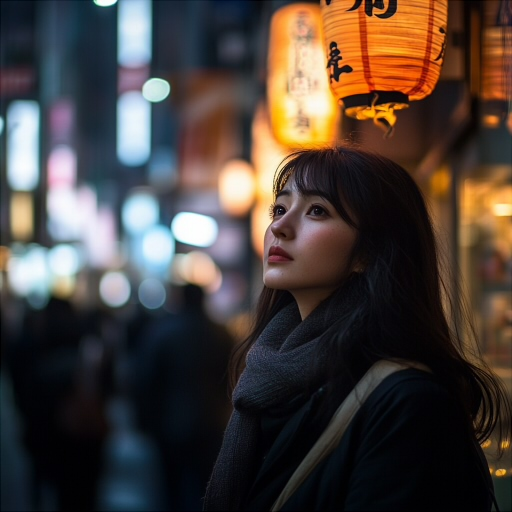
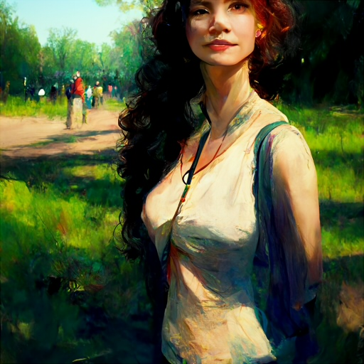
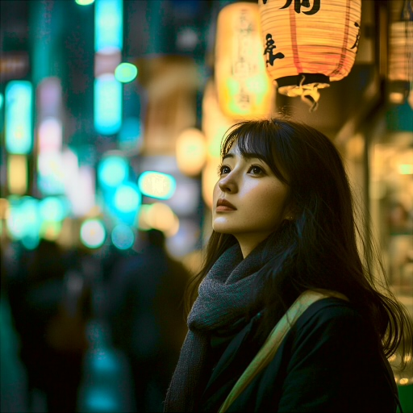
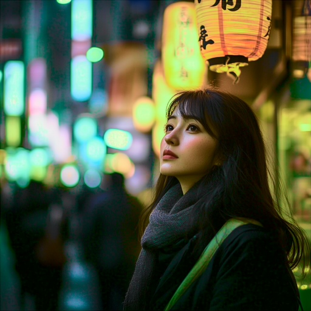

# Chroma Rotation Averaging (CRA) for Color Matching

A collection of Python scripts for histogram-based color matching between images. Particularly useful in upscaler pipelines where some steps cause color shifts, resulting in duller or less vibrant images.

## Overview

The repository includes five scripts in two color space variants:

### LAB Color Space (recommended)
- **`color_correction_basic.py`**: Single-pass LAB histogram matching with optional luminosity preservation.
- **`color_correction_cra.py`**: Applies the Chroma Rotation Averaging (CRA) technique in LAB space, rotating the AB chroma plane.
- **`color_correction_tiled.py`**: Extends CRA with overlapping tile-based processing for images with spatially varying color casts.

### RGB Color Space
- **`color_correction_basic_rgb.py`**: Simple RGB histogram matching in linear RGB space.
- **`color_correction_cra_rgb.py`**: CRA technique in RGB space, rotating around the gray axis (1,1,1). Includes optional perceptual weighting.

## Chroma Rotation Averaging (CRA) Technique

The Chroma Rotation Averaging (CRA) technique is an extension of basic histogram matching that mitigates color flips and improves overall color accuracy.

### The Problem

Basic histogram matching considers each color channel separately, which can sometimes lead to colors aligned with the LAB color space's A-B axes flipping 180° in hue. This often manifests as:

- Dark blues shifting to purple or reddish-gray
- Skin tones losing their complex gradients
- Visible color banding with hard edges

### The Solution

1. Perform histogram matching at multiple rotations of the color plane (0°, 30°, and 60° for LAB; 0°, 40°, and 80° for RGB).
2. Rotate each result back to the original orientation.
3. Average the results together.
4. Apply iteratively with increasing blend factors (25% → 50% → 100%) for stability.

By considering rotated color planes during histogram matching, CRA captures actual color relationships rather than just individual channel statistics. This guides colors in the right direction and prevents most color flips.

### Variant Differences

- **LAB CRA**: Rotates only the AB (chroma) plane, leaving luminosity independent. Uses 0°, 30°, 60° rotations.
- **RGB CRA**: Rotates the entire RGB cube around the neutral gray axis using Rodrigues' rotation formula. Uses 0°, 40°, 80° rotations (evenly spaced across the 120° rotational symmetry).

## Installation

1. Create a virtual environment:
   ```bash
   python3.10 -m venv venv
   ```

2. Install dependencies:
   ```bash
   venv/bin/python -m pip install opencv-python Pillow scikit-image numba
   ```

## Usage

```bash
venv/bin/python <script>.py --input <input_image> --ref <reference_image> --output <output_image>
```

- `<input_image>`: The image that needs color correction (e.g., an upscaled image with shifted colors).
- `<reference_image>`: The image with the desired color characteristics (e.g., the original before upscaling).
- `<output_image>`: Where to save the color-matched result.

All scripts support `--verbose` / `-v` for detailed progress logging.

## Examples

| Original | No Matching | Basic | CRA | Tiled CRA |
|----------|------------------------|-------|-----|-----------|
|  |  |  |  |  |
|  |  |  |  |  |

The first row shows close-up views of the color-corrected regions; the second row shows the full images.

Notice how the CRA technique effectively preserves the vivid and complex skin colors and the depth of the brightest and darkest blues. The upscale without color matching loses saturation in the cyan range. Basic histogram matching causes some of the darkest blues to shift into purple-gray and introduces significant banding. CRA reduces most of these issues, with some minor desaturation in the mid blues. Combined with tiled processing, the gradients match the original almost perfectly—vibrant cyans and deep dark blues throughout.

| Basic | Tiled CRA |
|-------|-----------|
|  |  |

## Gallery


## Tiled Processing

The `color_correction_tiled.py` script divides images into overlapping blocks for localized color correction. This helps with images that have spatially varying color casts, such as mixed lighting or gradients that span the entire image.

### How It Works

1. **Block generation**: Creates a 9×9 grid of tiles, then forms 64 overlapping 2×2-tile blocks (50% overlap between adjacent blocks)
2. **Per-block CRA**: Each block undergoes iterative CRA correction matched against the corresponding region of the reference image
3. **Hamming window blending**: Results are accumulated using Hamming window weights for smooth transitions between blocks
4. **Global histogram match**: A final global LAB histogram match ensures overall color distribution matches the reference

### Channel Handling

| Channel | Default Behavior | With `--tiled-luminosity` |
|---------|------------------|---------------------------|
| A, B (chroma) | Per-block CRA → global match | Per-block CRA → global match |
| L (luminosity) | Original L → global match | Per-block match → global match |

Use `--tiled-luminosity` when different regions need different brightness adjustments. In most upscaling scenarios, the default works well since luminosity differences are typically global rather than localized.

## Script Options

| Script | Options |
|--------|---------|
| `color_correction_basic.py` | `--keep-luminosity` (preserve original L channel) |
| `color_correction_cra.py` | `--keep-luminosity` (preserve original L channel) |
| `color_correction_cra_rgb.py` | `--perceptual` / `-p` (weight channels by Rec.709 luminance) |
| `color_correction_tiled.py` | `--tiled-luminosity` (process L channel per-tile before global match) |

## Image Retargeting

In addition to matching colors between versions of the same image, CRA can retarget an image to match the color characteristics of a completely different reference image.

| Input | Reference | Basic | CRA |
|-------|-----------|-------|-----|
|  |  |  |  |

In this example, the input is a Midjourney V6 image of a woman in a city, while the reference is a Midjourney V3 image of a woman in a park.

Basic histogram matching primarily adds cyan and orange tones, but the face takes on a greenish hue with visible patches of color banding. CRA matching pushes more greens into the overall palette while retaining smooth gradients in the face shading—no banding, more complex color gradients, and vivid skin tones.

**Note**: CRA retargeting is intentionally non-reversible (it shifts color gradients toward the target), while basic matching is mostly reversible aside from banding artifacts.

## Acknowledgements

Code primarily written by DeepSeek R1 and Claude Sonnet, with manual fixes for dithering. Refactored with Claude Opus 4.5. README by Claude Opus.

## License

[BSD 3-Clause License](LICENSE.md)
